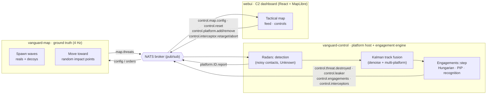
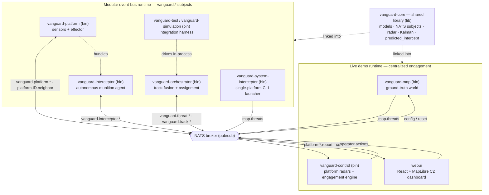
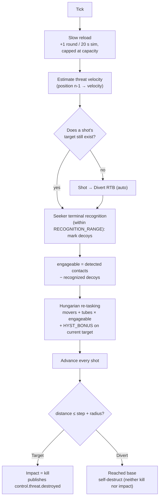
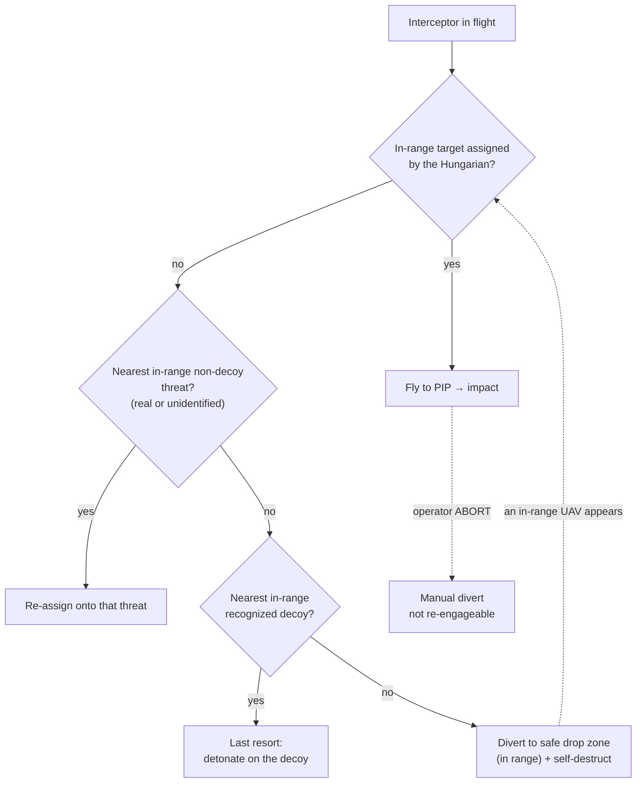

# Vanguard C2 — Distributed interceptor coordination


Real-time air-defense system: several interception platforms share their detections, and a
central decision engine fuses tracks, prioritizes threats and assigns targets optimally — to
defeat the saturation attacks a single-interceptor defense cannot absorb.

## The problem

Modern threats arrive from every direction at once. A coordinated attack (4 simultaneous
drones on different vectors + swarms of decoys) overwhelms a single interceptor, and manual
coordination takes 15–20 seconds per engagement decision — far too slow.

The system must:

- **Fuse distributed sensors** (radar, optical) from the interception platforms into one unified picture
- **Prioritize threats automatically** (speed, proximity, danger level)
- **Assign each interceptor to its optimal target** based on range, reload time and engagement probability
- **Track network state**: remaining ammunition and status of every interceptor
- **Recompute assignments every 1–2 s** as threats move
- **Emit firing recommendations** with a confidence score per interceptor

## Architecture

Everything flows through **NATS** (pub/sub): no component talks to another directly, which
lets you add/remove platforms on the fly and plug in the dashboard as a plain subscriber.
The chain actually running for the demo:



- **`vanguard-map`** is ground truth: it spawns waves, moves the threats and publishes the full list (`Vec<Threat>`) on `map.threats` at 4 Hz.
- **`vanguard-control`** hosts every platform: their **radars detect** (noisy `Unknown` contacts) and publish on `platform.<id>.report`, a **Kalman fuser** denoises them across platforms, then the **engagement engine** (`Engagements::step`) decides and executes the firing. It publishes kills, leakers, the firing picture and in-flight interceptors.
- **`webui`** is a plain subscriber that renders the situation and republishes operator actions (simulation config, add/remove platform, re-tasking/abort) on NATS.

### Whole-backend map

The Cargo workspace holds two runtime topologies over the same `vanguard-core` library and
the same NATS broker: the **centralized** demo chain above, and a **modular event-bus**
design (one process per platform / interceptor / orchestrator). Every crate depends on
`vanguard-core`.



| Crate                                   | Kind    | Role                                                                           |
| --------------------------------------- | ------- | ------------------------------------------------------------------------------ |
| `vanguard-core`                         | lib     | Shared serde models, NATS subjects, radar, Kalman fusion, PIP solver           |
| `vanguard-map`                          | bin     | Ground-truth simulation (spawns, movement, leakers) — **demo**                 |
| `vanguard-control`                      | bin     | Hosts all platform radars + the engagement engine (Hungarian/PIP) — **demo**   |
| `webui`                                 | —       | React + MapLibre C2 dashboard — **demo**                                       |
| `vanguard-platform`                     | bin+lib | One interception platform (sensors + effector); bundles `vanguard-interceptor` |
| `vanguard-interceptor`                  | bin+lib | Autonomous interceptor (munition) agent                                        |
| `vanguard-orchestrator`                 | bin+lib | Track fusion + weapon-target assignment over the `vanguard.*` bus              |
| `vanguard-system-interceptor`           | bin     | Single-platform launcher via clap CLI                                          |
| `vanguard-test` (`vanguard-simulation`) | bin     | Integration harness wiring platform + orchestrator + interceptor               |

## Algorithms

### Multi-platform track fusion (Kalman)

Radars report **noisy** position measurements (±50 m), and the same threat is often seen by
several platforms at once. Before any decision, `vanguard-control` fuses them
(`fusion.rs`): the platforms' simultaneous measurements of a threat are **averaged**
(independent noise → error shrinks by √N), then a constant-velocity **Kalman filter**
(`vanguard_core::KalmanTrack`, one track per threat) smooths the estimate over time —
`predict(dt)` propagates the track, `update(x, y)` folds in the fused measurement. The
engagement then reasons about this **denoised** picture rather than raw radar blips. (A unit
test asserts the fused track beats a single raw measurement.)

### Engagement loop (one `Engagements::step` tick)

On each tick the engine slowly resupplies ammunition, estimates threat velocity, lets the
interceptor seekers recognize decoys in the terminal phase, then globally re-optimizes the
**interceptors+tubes × threats** assignment with the **Hungarian algorithm**
(`pathfinding::kuhn_munkres`) using anti-oscillation hysteresis. Each interceptor–threat
pair is scored by `engage_value` = **danger level** + **proximity to the defended asset** −
**flight distance** (and only inside the platform's range), so higher-level, closer threats
are engaged first.



The **Predicted Intercept Point (PIP)** — `vanguard_core::predicted_intercept` — solves the
quadratic `|target + v·t − shooter| = speed·t` to aim ahead at where the threat _will be_,
not where it is.

### In-flight interceptor decision hierarchy

**Hard constraint: an interceptor never leaves its launching platform's range circle** — it
only ever pursues targets _inside_ that range, and its flight is clamped to the range
boundary as a safety net. It is never wasted: it only diverts as a last resort, and an
automatic divert can **re-engage** a fresh in-range UAV. Only a **manual abort** is sticky.



The **safe drop zone** is a point offset from the platform, inside its range (a random
bearing at 40 % of the range) — always reachable, never on top of the base.

## Stack

- **Rust** (edition 2024)
- **clap** (CLI), **uuid** (v4 ids), **rand** (seeded determinism)
- **NATS** ([`async-nats`](https://crates.io/crates/async-nats)) as the publish-subscribe broker, **serde / serde_json** for messages
- **`pathfinding::kuhn_munkres`** for the Hungarian weapon-target assignment
- **webui**: React 19 + TypeScript + Vite + MapLibre GL + Tailwind, [`nats.ws`](https://github.com/nats-io/nats.ws) over a WebSocket NATS listener

## Getting started

### Option A — Docker Compose (one command)

The whole stack (NATS + map + control + dashboard) in one go:

```bash
docker compose up --build
# then open http://localhost:5173
```

That builds the two Rust binaries and the dashboard, starts the NATS broker
(`nats.conf`: TCP 4222 + WebSocket 8080), and wires everything together. The
browser talks to NATS directly over `ws://localhost:8080`. Stop with `Ctrl-C`
(or `docker compose down`). The services are defined in `docker-compose.yml`:

| Service   | Image                         | Role                               |
| --------- | ----------------------------- | ---------------------------------- |
| `nats`    | `nats:latest`                 | broker (4222 TCP + 8080 WebSocket) |
| `map`     | `edth-backend` (`Dockerfile`) | ground-truth simulation            |
| `control` | `edth-backend` (`Dockerfile`) | platform host + engagement engine  |
| `webui`   | `webui/Dockerfile` (nginx)    | C2 dashboard on `:5173`            |

### Option B — Run from source

Once the toolchain is installed (see below), the quickest local loop is the dev
script — it starts NATS + map + control + dashboard and stops them all on `Ctrl-C`
(Rust builds incrementally, the dashboard runs with hot reload):

```bash
./dev.sh        # then open http://localhost:5173
```

Or do it by hand:

```bash
# 1. Rust toolchain (once per machine) — edition 2024 → rustc >= 1.85
curl --proto '=https' --tlsv1.2 -sSf https://sh.rustup.rs | sh
rustup update

# 2. Clone and build the project (dependencies install themselves)
git clone <repo-url> && cd edth_drone
cargo build

# 3. Sanity checks
cargo test               # workspace tests
cargo clippy --workspace # lint
cargo fmt --check        # formatting

# 4. Start the NATS broker (terminal 1) — TCP 4222 for the binaries + WebSocket
#    8080 for the dashboard (nats.conf enables both).
docker run -p 4222:4222 -p 8080:8080 \
  -v "$PWD/nats.conf:/etc/nats/nats.conf:ro" nats:latest -c /etc/nats/nats.conf

# 5. Run the map (terminal 2): ground truth, publishes threats on NATS
cargo run -p vanguard-map

# 6. Run the platform host (single process): starts with the Kyiv preset
#    (7 perimeter platforms, 20 km range). You then add/remove/place
#    platforms from the dashboard. This process also DECIDES the firing
#    (Hungarian assignment) and executes it.
#    RECOGNITION_RANGE_M (default 4000) = range at which an interceptor's
#    seeker tells a real threat from a decoy (terminal phase).
cargo run -p vanguard-control

# 7. The web dashboard (real map centered on Kyiv + control panel)
cd webui && pnpm install && pnpm dev    # http://localhost:5173
```

`NATS_URL` is overridable via environment variable (default `nats://127.0.0.1:4222`). The
web client connects to the NATS **WebSocket** listener (default `ws://127.0.0.1:8080`).

The dashboard's **SIMULATION CONTROL** panel drives the map live (**time acceleration**
×1–10, decoy ratio, wave size/cadence, zone radius, active cap), lets you **add a platform
by clicking the map** (name / range / ammo), remove one, and **reset** (`↺ RESET`) to the
baseline scenario. Everything goes through NATS: the UI publishes on `control.map.config` /
`control.platform.add` / `control.platform.remove` / `control.reset`.

### Recognition & engagement, in prose

Platforms **detect only** (every contact is `Unknown` — they do not tell real from decoy).
`vanguard-control` assigns the detected contacts with the Hungarian algorithm (in-flight
interceptors + free tubes × contacts), with hysteresis for dynamic re-tasking (never two
shots on the same threat, never a good shot wasted). Each tube launches a **real
interceptor** that flies to its PIP.

The **interceptor's seeker recognizes** real vs decoy in the **terminal phase** once within
`RECOGNITION_RANGE` (default 4 km, env `RECOGNITION_RANGE_M`): real threat → impact (kill);
**decoy → excluded** from future engagements (no wasted ammo) and the interceptor is
**immediately re-assigned to the nearest threat** (see the decision hierarchy above) — it
only returns to base (RTB) as a last resort with no target left. Ammunition is resupplied
slowly (+1 every 20 s of simulated time, capped at the initial capacity) to sustain a
prolonged engagement. Recognition is stamped onto the reports → the dashboard colors the
track (amber `UNKNOWN` → red `REAL` / grey `DECOY`) the moment an interceptor identifies it.

**Manual re-tasking**: click an interceptor then a threat to redirect it; the **ABORT**
button sends it **back to base** (RTB) to self-destruct — a manual abort does not re-engage,
unlike an automatic divert. In-flight munition positions are published on
`control.interceptors`; the dashboard animates them (**cyan darts + trail**), smoothly
interpolated like the threats.

### Visual feedback & metrics

- **Impact burst**: an expanding ring on every kill (cyan) and on every real ground impact (red), placed at the exact position.
- **Event feed** (side panel): timestamped log `NEUTRALIZED` / `⚠ IMPACT` / `decoy spent`, C2-ticker style.
- **Header counters**: `NEUTRALIZED` (threats shot down) and **`IMPACTS`** (real drones that hit Kyiv — the damage metric; decoys that leak don't count).
- The backend publishes kills on `control.threat.destroyed` (with position) and leakers on `control.leaker` (with `is_decoy`, to tell a real impact from a harmless decoy).

> The `vanguard-system-interceptor` binary (single platform via CLI, `--reach` option)
> remains available if you prefer launching platforms as separate processes.

## Current use

### Map (ground truth)

**Swarm waves** (6–12 drones) arrive every ~45 s from a random azimuth sector (50 km ingress
ring), mixing real attack drones and **decoys** (~40 %). Each drone aims at its **own random
impact point** within a 6 km-radius defended zone around Kyiv center (no single point). The
**platforms detect only** (`Unknown` contacts) — the **interceptor's seeker** tells real
from decoy in the terminal phase (`RECOGNITION_RANGE`). The map publishes ground truth
(`Vec<Threat>`) on `map.threats` at 4 Hz; the platforms publish their radar reports on
`platform.<id>.report`.

```bash
cargo run -p vanguard-map
```

```
map online — publishing threats on `map.threats` via nats://127.0.0.1:4222
[   0.0s] threat 351af624 spawned at (-4931, -830) — 57 m/s, level 4
[   1.0s] threat 351af624 at (-4875, -821)
[  ...s ] threat 351af624 reached defended point — LEAKER
```

The simulation is reproducible (fixed seed `SEED = 42` in `vanguard-map/src/main.rs`, like
the other constants: spawn cadence, speeds, ranges).

### Interception platform (standalone)

Long-lived process: its radar subscribes to `map.threats` and **prints its own detections** —
`RADAR CONTACT` on first acquisition of a threat, then its radar picture on each update
(`radar: <contacts>` or `radar: no contact`).

```bash
cargo run -p vanguard-system-interceptor -- --name alpha -n 4 -x -300 -y 250
```

```
alpha (id 3472121a-…) online at (-300, 250) — radar range 1500 m, 4 interceptor(s) ready
alpha radar active — listening on `map.threats` via nats://127.0.0.1:4222
alpha radar: no contact
alpha RADAR CONTACT threat becf8dfa at (-172, -2167) — range 1492 m
alpha radar: becf8dfa at 1492 m
```

| Option                 | Role                                    | Default  |
| ---------------------- | --------------------------------------- | -------- |
| `--name`               | platform name                           | required |
| `-n`, `--interceptors` | number of interceptors (rounds) carried | 4        |
| `-x`, `-y`             | position in meters                      | 0.0      |

The platform id and each interceptor id are v4 UUIDs generated at launch.

## Status

- [x] Data models (`vanguard-core`: threats, platforms, interceptors, states, reports)
- [x] Simulated map: continuous spawning, movement toward defended points, radar detection signals, leakers
- [x] Single-platform launch via CLI (UUID, ammo, position)
- [x] NATS transport between the map, platform host and dashboard
- [x] Optimal assignment (Hungarian algorithm, range and ammo constraints)
- [x] Real/decoy recognition by the interceptor seeker (terminal phase)
- [x] Dynamic re-tasking mid-engagement + manual re-target / abort (RTB)
- [x] Predicted Intercept Point (PIP) interception with live trajectories
- [x] Kalman track fusion across multiple platforms in the demo (`vanguard-control` averages each platform's noisy radar measurement of a threat, then smooths it with one `KalmanTrack` per threat; the engagement reasons about the denoised picture)
- [ ] Confidence scores on firing recommendations
- [ ] Migrate shared types into the `common` crate
